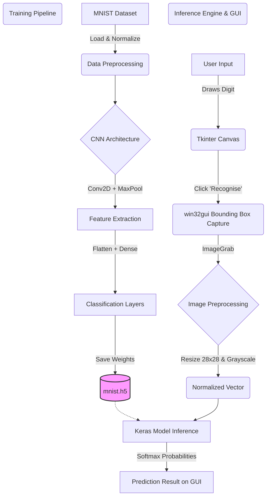

# System Architecture

The Handwritten Digit Recognizer uses a decoupled architecture, separating the Deep Learning training pipeline from the real-time inference Graphical User Interface. 

## Architectural Flow

### Components Details

1. **Training (`train_digit_recognizer.py`)**:
   - Downloads the standard MNIST dataset consisting of 60,000 training and 10,000 testing images.
   - Defines a Convolutional Neural Network (CNN) with Adadelta optimizer.
   - Saves the trained model to `mnist.h5`.

2. **Inference/GUI (`gui_digit_recognizer.py`)**:
   - **Canvas Tracking**: A 300x300 pixel area capturing mouse inputs.
   - **Window Rectangulation**: `win32gui.GetWindowRect()` captures global display coordinates to take a screenshot of precisely the canvas area using `ImageGrab`.
   - **Prediction Mapping**: Outputs the predicted digit label and a confidence score percentage.
